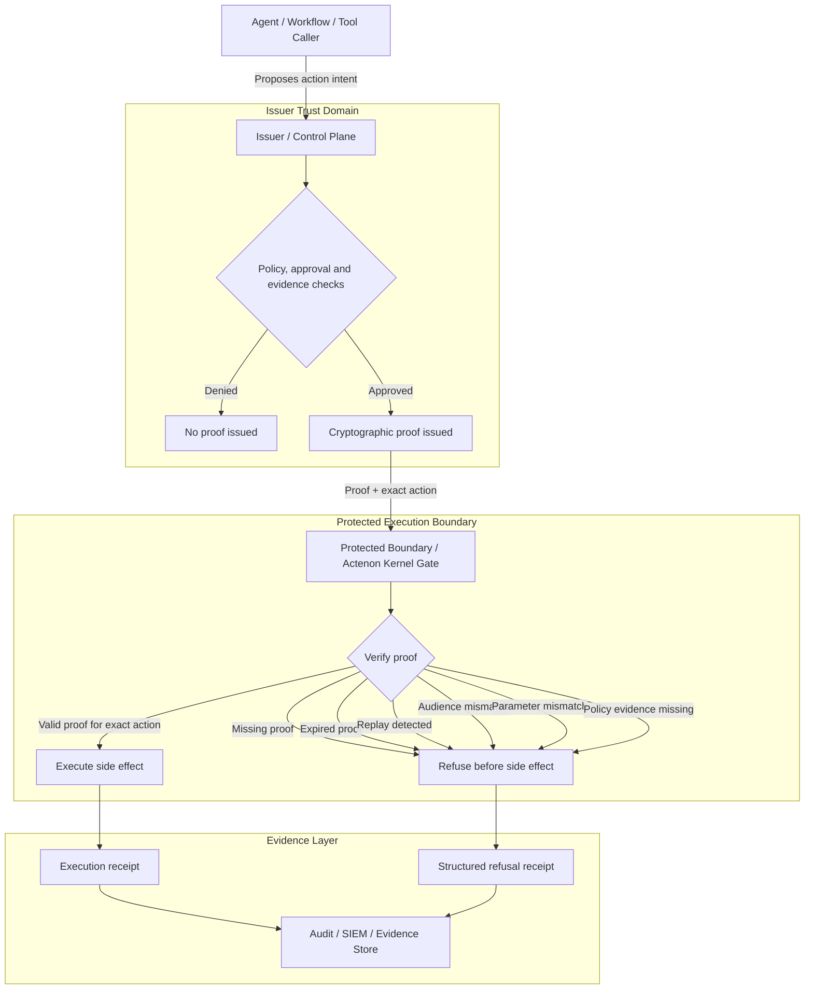

# actenon-kernel

**The open proof gate for agentic execution.**

> **No valid proof, no execution.**

Actenon protects the place where AI agents become dangerous: **the execution boundary**.

Models can reason. Agents can ask. Tools can propose. But the protected boundary — the API, MCP tool, service, database, payments rail, IAM control plane, release pipeline, infrastructure endpoint or internal workflow — decides whether the action is allowed to happen.

Actenon refuses consequential actions unless the caller presents cryptographic proof bound to the **exact action** being attempted.

If the proof is missing, expired, replayed, audience-mismatched, policy-denied, malformed or bound to different parameters, the action is refused **before the side effect**.

Actenon is not a prompt filter. It is not an output moderator. It is not another layer of “please behave” instructions for an LLM.

It is an execution-edge control:

> **The agent may ask. The protected boundary decides.**

---

## Why developers should care

AI agents are moving from chat to action.

They can now call tools, issue refunds, deploy code, modify databases, update IAM roles, export data, restart infrastructure, administer workflows and coordinate with other agents.

That creates a new failure mode:

> The model may be wrong, compromised, manipulated, over-authorised, prompt-injected or simply confused — but the side effect still happens.

Actenon focuses on the moment that matters most:

> The execution gap: the moment between an agent proposing an action and a system actually doing it.

At that point, the boundary must be deterministic.

---

## Run the proof in 60 seconds

Developers should not have to read the whole repo to understand the guarantee.

Run this and watch one approved action execute while a hallucinated/tampered action, a replay and a no-proof attempt are refused before any side effect:

```bash
git clone https://github.com/Actenon/actenon-kernel.git
cd actenon-kernel

python3 -m venv .venv
source .venv/bin/activate

python3 -m pip install --upgrade pip
python3 -m pip install -e ".[asymmetric]"

python examples/interactive_execution_demo.py
```

Expected shape:

```text
✅ approved refund: ord-123 £25.00 -> executed
🛑 hallucinated refund: ord-456 £2,500.00 -> refused / INTENT_MISMATCH
🛑 replay approved refund -> refused / DUPLICATE_REPLAY
🛑 refund with no proof -> refused / PCCB_REQUIRED

Final ledger events: [{'order_id': 'ord-123', 'amount_cents': 2500}]

No valid proof, no execution.
```

The important part is not the demo domain. It is the invariant:

> **The side-effect function only runs for the proof-bound action.**

This repo is designed to be evaluated locally: no cloud account, no external service, no real payment rail and no destructive action.

---

## First three things to try

| Goal | Command / section |
|---|---|
| See a bad action get dropped | `python examples/interactive_execution_demo.py` |
| See the smallest proof | `python examples/quickstart_min.py` |
| Protect one Python function | [The 3-line adoption model](#the-3-line-adoption-model) |
| Protect MCP or LangChain tools | [Framework wrappers](#framework-wrappers) |
| Run the evidence suite | [Evidence examples](#evidence-examples) |

---

## Quickstart

```bash
git clone https://github.com/Actenon/actenon-kernel.git
cd actenon-kernel

python3 -m venv .venv
source .venv/bin/activate

python3 -m pip install --upgrade pip
python3 -m pip install -e ".[asymmetric]"

python examples/quickstart_min.py
```

Expected outcome:

```text
ACTENON QUICKSTART
valid: EXECUTED
mismatch: REFUSED (INTENT_MISMATCH)
replay: REFUSED (DUPLICATE_REPLAY)
side_effects: 1
No valid proof, no execution.
```

---

## The mental model

Every consequential action must present proof that says:

- who authorised it
- what action was authorised
- what exact parameters were authorised
- which audience/service may execute it
- when the proof was issued
- when it expires
- whether it has already been used
- what policy evidence, if any, was required

The protected boundary verifies that proof immediately before execution.

If the attempted action does not match the proof exactly, the side effect does not run.

---

## Production trust model: issuer and verifier are separate

The local examples use `ActenonGate.local_dev(...)` so the repo can be understood and tested without infrastructure.

In those examples, proof minting and proof verification may happen in one process for developer convenience.

That is not the production trust model.

In production, the issuer/control plane and protected boundary should be separate trust domains.

The issuer decides whether proof may exist. The protected boundary decides whether the side effect may happen.



Text form:

```text
agent / workflow
        |
        | proposes Action Intent
        v
issuer / control plane
        |
        | evaluates policy, approvals, evidence, tenant, subject and target audience
        | issues proof for the target protected boundary
        v
protected boundary / kernel gate
        |
        | verifier-only; cannot mint proof
        | verifies exact action immediately before side effect
        | executes or refuses
        v
receipt / refusal evidence
```

Actenon Kernel is the open enforcement layer.

Actenon Cloud is an optional managed issuer and governance layer.

You can self-host the guarantee. Cloud is the build-versus-buy path for operating issuance, approvals, evidence, receipts, transparency and audit.

The security guarantee is not gated behind Actenon Cloud:

> **No valid proof, no execution.**

Actenon Cloud removes operational burden. It does not unlock a stronger kernel guarantee than the open-source kernel.

---

## The 3-line adoption model

Start here.

The direct `gate.protect()` path is the lowest-friction way to understand and adopt Actenon.

```python
from actenon import ActenonGate

gate = ActenonGate.local_dev(audience="service:refunds")

action = gate.build_action(
    "refund.issue",
    "payment.refund",
    {"order_id": "ord-123", "amount_cents": 2500},
    target_type="order",
    target_id="ord-123",
    tenant_id="demo",
    requester_id="support-agent",
)

# Local demo only: mint a proof with the local development signer.
# In production, your issuer/control plane mints proof after auth,
# policy checks and any required approval. The protected tool only verifies it.
proof = gate.mint_proof(action)

outcome = gate.protect(
    action,
    proof,
    lambda: issue_refund(order_id="ord-123", amount_cents=2500),
    audience="service:refunds",
)
```

That is the core mental model:

1. Build the action intent.
2. Present proof for that exact action.
3. Protect the side effect.

If the proof does not validate, the lambda is never called.

---

## Minimal example: protected refund

```python
from datetime import datetime, timedelta, timezone

from actenon import ActenonGate

now = datetime.now(timezone.utc)
ledger = {"refunds": []}


def issue_refund(order_id: str, amount_cents: int):
    ledger["refunds"].append(
        {"order_id": order_id, "amount_cents": amount_cents}
    )
    return {"refunded": order_id, "amount_cents": amount_cents}


def refund_intent(order_id: str, amount_cents: int):
    return {
        "contract": {"name": "action_intent", "version": "v1"},
        "intent_id": f"intent_refund_{order_id}_{amount_cents}",
        "issued_at": now.isoformat(),
        "expires_at": (now + timedelta(minutes=10)).isoformat(),
        "tenant": {"tenant_id": "demo"},
        "requester": {"type": "agent", "id": "support-agent"},
        "action": {
            "name": "refund.issue",
            "capability": "payment.refund",
            "parameters": {
                "order_id": order_id,
                "amount_cents": amount_cents,
            },
        },
        "target": {"resource_type": "order", "resource_id": order_id},
    }


gate = ActenonGate.local_dev(audience="service:refunds")

approved = refund_intent("ord-123", 2500)
proof = gate.mint_proof(approved)

# Executes.
ok = gate.protect(
    approved,
    proof,
    lambda: issue_refund("ord-123", 2500),
    audience="service:refunds",
)

# Refuses: same proof, different amount.
tampered = gate.protect(
    refund_intent("ord-123", 250000),
    proof,
    lambda: issue_refund("ord-123", 250000),
    audience="service:refunds",
)

print(ok)
print(tampered)
print(ledger)
```

The protected boundary does not care what the model “intended”. It verifies the exact action.

---

## Issuer-side policy preflight

Proof should not be minted just because an action has the right shape.

Issuer-side policy is where business and domain rules are checked before proof exists. Invalid actions should fail at the control plane, not at the side-effect boundary.

A protected refund policy might enforce:

- `amount_cents` must be an integer
- `amount_cents` must be greater than zero
- `amount_cents` must be below the policy limit
- the target order/account must exist
- the requester must be allowed to request the refund
- required approval evidence must be present for high-risk actions

Run the policy preflight evidence:

```bash
python -m pytest examples/protected_policy_preflight_refund -q
```

It proves:

- positive refund → proof minted → side effect executes
- negative refund → proof not minted → no side effect
- excessive refund → proof not minted → no side effect
- proof for a small refund cannot be reused for a larger refund

The principle:

> Invalid business actions should die before cryptographic proof exists.

---

## Copy/paste adoption paths

Actenon is designed to be adopted at the execution boundary with the lowest possible developer friction.

Start with the direct `gate.protect()` path. It is the smallest mental model and the best first integration path.

Once the direct path is understood, use the framework adapter that matches your runtime.

| Runtime | Proof travels in | Use when |
|---|---|---|
| Direct Python | Argument to `gate.protect()` | First adoption, tests, services, jobs, workers |
| MCP / FastMCP | Request metadata / context | Protecting MCP tools |
| LangChain / LangGraph | `RunnableConfig` | Keeping proof out of model-visible tool schemas |
| FastAPI / HTTP | `X-Actenon-Proof` header | Protecting HTTP APIs and service boundaries |
| Express / HTTP | Header or request metadata | Protecting JavaScript/Node service boundaries |

The evidence examples are intentionally runnable. They show how proof enters each runtime channel and how refusals behave locally.

---

## Framework wrappers

These are integration sketches showing where proof should travel in common agent frameworks.

In production, proof is issued by your issuer/control plane and passed through framework metadata or request context.

It should not be exposed as a normal model-controlled argument.

### LangChain / LangGraph

Keep proof outside the model-visible tool schema by passing it through `RunnableConfig`.

```python
from langchain_core.runnables import RunnableConfig
from langchain_core.tools import tool

from actenon import ActenonGate

gate = ActenonGate.local_dev(audience="service:refunds")


def issue_refund(order_id: str, amount_cents: int):
    return {"status": "refunded", "order_id": order_id, "amount_cents": amount_cents}


@tool
def refund_order(order_id: str, amount_cents: int, config: RunnableConfig):
    """Issue an approved refund."""
    proof = config.get("configurable", {}).get("x-actenon-proof")

    action = gate.build_action(
        "refund.issue",
        "payment.refund",
        {"order_id": order_id, "amount_cents": amount_cents},
        target_type="order",
        target_id=order_id,
        tenant_id="demo",
        requester_id="support-agent",
    )

    return gate.protect(
        action,
        proof,
        lambda: issue_refund(order_id, amount_cents),
        audience="service:refunds",
    )
```

### FastMCP

Protect model-visible MCP tools at the server boundary.

```python
from mcp.server.fastmcp import FastMCP

from actenon import ActenonGate

mcp = FastMCP("Protected Refund Server")
gate = ActenonGate.local_dev(audience="mcp:refunds")


def issue_refund(order_id: str, amount_cents: int):
    return {"status": "refunded", "order_id": order_id, "amount_cents": amount_cents}


@mcp.tool()
def refund_order(order_id: str, amount_cents: int, ctx=None) -> str:
    """Issue an approved refund."""
    proof = None
    if ctx is not None:
        proof = getattr(getattr(ctx, "request", None), "meta", {}).get("X-Actenon-Proof")

    action = gate.build_action(
        "refund.issue",
        "payment.refund",
        {"order_id": order_id, "amount_cents": amount_cents},
        target_type="order",
        target_id=order_id,
        tenant_id="demo",
        requester_id="mcp-agent",
    )

    outcome = gate.protect(
        action,
        proof,
        lambda: issue_refund(order_id, amount_cents),
        audience="mcp:refunds",
    )

    status = getattr(outcome, "status", None)
    reason = getattr(outcome, "reason", "refused")
    return "Executed" if status == "EXECUTED" else f"Denied: {reason}"
```

### FastAPI / HTTP

Pass proof in a header, away from the request body the agent composes.

```python
from fastapi import FastAPI, Header

from actenon import ActenonGate

app = FastAPI()
gate = ActenonGate.local_dev(audience="service:refunds")


def issue_refund(order_id: str, amount_cents: int):
    return {"status": "refunded", "order_id": order_id, "amount_cents": amount_cents}


@app.post("/refunds/{order_id}")
def refund_order(
    order_id: str,
    amount_cents: int,
    x_actenon_proof: str | None = Header(default=None),
):
    action = gate.build_action(
        "refund.issue",
        "payment.refund",
        {"order_id": order_id, "amount_cents": amount_cents},
        target_type="order",
        target_id=order_id,
        tenant_id="demo",
        requester_id="agent-or-service",
    )

    return gate.protect(
        action,
        x_actenon_proof,
        lambda: issue_refund(order_id, amount_cents),
        audience="service:refunds",
    )
```

---

## Evidence examples

Actenon includes runnable, self-verifying examples that demonstrate proof-bound execution across different frameworks, domains and agent topologies.

| Example | What it proves |
|---|---|
| `examples/interactive_execution_demo.py` | A hallucinated/tampered action, replay and missing-proof attempt are refused before side effects. |
| `examples/quickstart_min.py` | The smallest local proof-bound execution path. |
| `examples/protected_policy_preflight_refund` | Issuer-side policy preflight blocks invalid business actions before proof issuance. |
| `examples/financial_agent_protected_transfer` | Financial transfer/refund actions are exact-action bound and replay-protected. |
| `examples/fastmcp_financial_transfer` | MCP/FastMCP tools refuse unproven consequential actions. |
| `examples/protected_multi_agent_swarm` | Shared replay state enforces exactly one action across a multi-agent swarm, including real concurrency. |
| `examples/protected_iam_control_plane` | Policy layer blocks privileged IAM grants unless approval evidence is present. |
| `examples/protected_cicd_pipeline` | Release pipeline deploys only the approved artifact to the approved environment, if present in this checkout. |
| `examples/protected_clinical_ehr_agent` | Illustrative safety-critical HTTP example; not clinical certification. |

Run the core evidence suite:

```bash
python -m pytest \
  examples/protected_policy_preflight_refund \
  examples/financial_agent_protected_transfer \
  examples/fastmcp_financial_transfer \
  examples/protected_multi_agent_swarm \
  examples/protected_iam_control_plane \
  -q
```

If your checkout includes `examples/protected_cicd_pipeline`, include it as well.

---

## What Actenon protects

Use Actenon when an AI agent, workflow, tool or automation can trigger a consequential side effect.

Good first use cases:

- payments, refunds, payouts, transfers, credits and account adjustments
- customer deletion, data export, record modification and sensitive data movement
- IAM grants, role changes, privileged access and production permissions
- CI/CD deployments, rollbacks, releases and infrastructure changes
- MCP tools, browser actions, coding-agent tools and workflow automations
- multi-agent swarms where multiple agents can act against shared resources

Healthcare, clinical and safety-critical examples in this repository are illustrative evidence examples only. They are not certification or a recommended first deployment market.

Actenon does **not** inspect prompts, filter ordinary model output or replace DLP.

It protects explicit execution-edge actions routed through an Actenon-protected boundary.

If an action is not routed through the protected boundary, Actenon cannot protect it.

---

## What Actenon guarantees

When a consequential action is routed through an Actenon-protected boundary, and the backend has no alternate unprotected route, Actenon can enforce:

- exact-action binding
- parameter binding
- audience binding
- time-bounded execution
- single-use replay protection
- structured refusal
- policy evidence checks
- receipt/refusal evidence
- framework-agnostic enforcement

The guarantee applies at the protected boundary.

It does not rely on the model following instructions.

---

## What Actenon does not guarantee

Actenon does not claim to:

- make an LLM truthful
- prevent all bad model output
- inspect arbitrary natural language responses
- replace access control, DLP, SIEM, EDR, IAM or application security
- protect resources reachable through unprotected paths
- certify production deployments by itself
- prove real-world adoption, latency under load or third-party audit status

Actenon protects explicit consequential actions at the boundary you own.

---

## Going to production: self-hosted or managed

The local quickstart uses `ActenonGate.local_dev(...)` because it is the fastest way to understand the model.

It is for development, demos and local tests only.

For production, you need the same guarantee backed by production infrastructure: asymmetric signing, managed key custody, durable replay protection, issuer metadata, audit logging, policy evidence and operational monitoring.

**You can run all of this yourself with the open kernel. None of it requires Actenon Cloud.**

Actenon Cloud is an optional managed service that operates this trust infrastructure for you. It does not unlock a stronger guarantee than the open kernel provides; it removes the operational burden of running the issuer, approval workflows, key custody integrations, durable replay stores, audit trails and transparency infrastructure yourself.

| Production capability | Self-hosted with `actenon-kernel` | Optional managed layer |
|---|---|---|
| Asymmetric signing | Use the kernel’s asymmetric signing support and your own signing process. | Hosted/managed proof issuance. |
| Key custody | Use your own KMS/HSM, such as AWS KMS, GCP KMS, Azure Key Vault or internal HSM. | Managed signing custody and rotation operations. |
| Key rotation | Publish and rotate keys using your own `kid` / public-key metadata process. | Managed key rotation and issuer metadata. |
| Durable replay protection | Use a shared durable replay store such as SQLite for local/single-node use or Postgres for production/shared boundaries. | Managed replay protection and operational monitoring. |
| Issuer metadata | Host your own well-known issuer metadata and public verification keys. | Hosted issuer discovery endpoint. |
| Tenant-aware policy | Use the open policy/preflight layer and evidence objects in this repo. | Managed policy configuration and governance workflows. |
| Approval evidence | Build or integrate your own approval flow that emits verifiable approval evidence. | Hosted human approval UI and workflow engine. |
| Receipts and refusals | Store the kernel’s structured receipts/refusals in your own logs, SIEM, data lake or audit system. | Managed receipt/refusal storage, search and reporting. |
| Auditability | Wire issuance, approval, execution, refusal and replay events into your own audit sink. | Managed audit trail and transparency reporting. |

The open kernel provides the full proof-bound execution guarantee on infrastructure you control:

> **No valid proof, no execution.**

The managed service is for teams that want Actenon operated for them. The kernel remains the neutral enforcement layer that can be adopted, audited and self-hosted without depending on Actenon Cloud.

---

## Documentation map

| Need | Start here |
|---|---|
| Understand the exact kernel guarantee | [`KERNEL_GUARANTEES.md`](KERNEL_GUARANTEES.md) |
| Understand project scope and limits | [`docs/SCOPE_AND_GUARANTEES.md`](docs/SCOPE_AND_GUARANTEES.md) |
| Understand issuance and approval | [`docs/guides/ISSUANCE_AND_APPROVAL.md`](docs/guides/ISSUANCE_AND_APPROVAL.md) |
| Understand integrations | [`INTEGRATIONS.md`](INTEGRATIONS.md) |
| Understand MCP adoption | [`MCP_HERO_PATH.md`](MCP_HERO_PATH.md) |
| Choose an SDK path | [`SDK_SELECTION_GUIDE.md`](SDK_SELECTION_GUIDE.md) |
| Check conformance | [`CONFORMANCE.md`](CONFORMANCE.md) |
| Review security posture | [`SECURITY.md`](SECURITY.md) |

---

## Local development commands

Install:

```bash
python3 -m venv .venv
source .venv/bin/activate
python3 -m pip install --upgrade pip
python3 -m pip install -e ".[asymmetric]"
```

Run quickstart:

```bash
python examples/quickstart_min.py
```

Run the interactive demo:

```bash
python examples/interactive_execution_demo.py
```

Run evidence:

```bash
python -m pytest \
  examples/protected_policy_preflight_refund \
  examples/financial_agent_protected_transfer \
  examples/fastmcp_financial_transfer \
  examples/protected_multi_agent_swarm \
  examples/protected_iam_control_plane \
  -q
```

Run package tests:

```bash
python -m pytest -q
```

Check README links:

```bash
python - <<'PY'
from pathlib import Path
import re

root = Path(".")
s = Path("README.md").read_text(encoding="utf-8")
missing = []

for link in re.findall(r"\[[^\]]+\]\(([^)]+)\)", s):
    if link.startswith(("http://", "https://", "#", "mailto:")):
        continue
    target = link.split("#")[0]
    if target and not (root / target).exists():
        missing.append(link)

if missing:
    print("Missing README links:")
    print("\n".join(missing))
    raise SystemExit(1)

print("README links OK")
PY
```

---

## FAQ

### Is Actenon an AI safety model?

No. Actenon is an execution-boundary control. It does not try to make the model safe. It makes the action boundary deterministic.

### Does the agent need to cooperate?

No. The boundary enforces proof before execution. The agent can ask, but it cannot force the side effect without valid proof.

### Can this work with third-party agents?

Yes, if the third-party agent must use a protected boundary to reach the resource.

### Can Actenon stop data leakage in normal model output?

No. Actenon can require proof for explicit export/transmit actions, but it does not inspect arbitrary model text unless that text is routed through a protected action.

### What happens if the agent has another credential or route?

Then the resource is not fully protected by Actenon. The protected edge must be the only route to the side effect, or backend credentials must only be issued after verification.

### Is the local signer production-ready?

No. The local development signer is for development and demos only. Production should use asymmetric signing under managed key custody.

### Does Actenon Cloud unlock a stronger kernel guarantee?

No. The kernel guarantee is open and self-hostable. Actenon Cloud is the managed issuer, approval, evidence, receipt and governance layer for teams that do not want to operate that control-plane infrastructure themselves.

### Why not just use IAM?

Use IAM too. IAM answers who or what has access. Actenon answers whether this exact agentic action, with these exact parameters, has valid proof at execution time.

### Why does replay protection matter?

Because agents retry, workers scale horizontally and swarms duplicate work. A valid proof must not become permission to execute the same side effect repeatedly.

---

## Contributing

Focused contributions are welcome around examples, tests, documentation, integrations, benchmark scenarios and developer ergonomics.

Security-sensitive changes to the kernel guarantee should be discussed before implementation.

Good first issues are labelled `good first issue`.

---

## Project status

Actenon Kernel is an open-source execution gate and evidence standard for proof-bound agentic actions.

The goal is to make proof-bound execution a normal default for high-risk AI-agent actions.

> **No valid proof, no execution.**
<!-- README_LF_NORMALIZED_FOR_GITHUB_RENDERING -->
