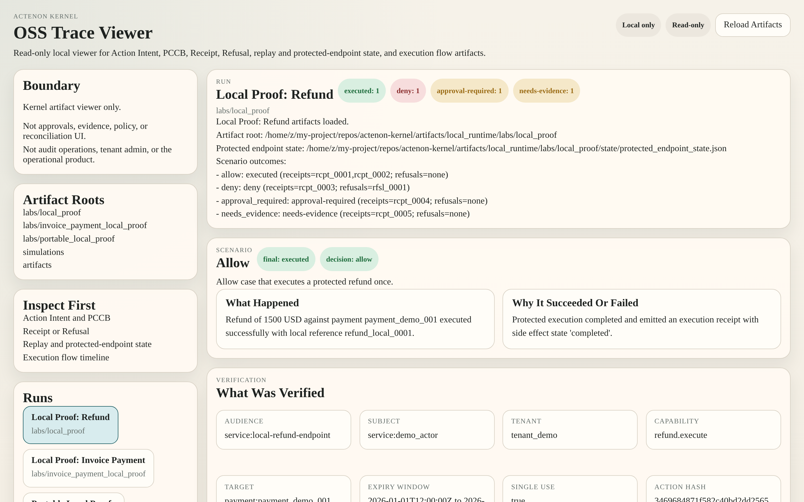

# Actenon Kernel

> The open verifier for proof-bound consequential execution. Defines what a valid proof is. Verifies proofs at the execution edge; issues no grants; runs no policy decisions.

[](LICENSE)
<!-- PYTHON-BADGE:START -->
[](https://www.python.org/)
<!-- PYTHON-BADGE:END -->
[](https://pypi.org/project/actenon-kernel/)
[](docs/CONFORMANCE.md)
[](docs/SPEC_INDEX.md)
[](docs/SDK_SELECTION_GUIDE.md)
[](https://github.com/Actenon/actenon-kernel/actions/workflows/ci.yml)
[](https://docs.astral.sh/ruff/)
[](#independence)

---

## The Actenon ecosystem

The Kernel is one of five independent repositories that together close the **execution gap** — the gap between *upstream authorization* and the *execution edge* that actually performs a consequential side effect.

<!-- ECOSYSTEM-TABLE:START -->
| Repository | Role | Depends on | Packages |
|---|---|---|---|
| **`actenon-protocol`** | The neutral wire contract — what every artefact looks like on the wire | — | `actenon-protocol` (PyPI) · `@actenon/protocol-types` (npm) |
| **`actenon-kernel`** ← you are here | The open verifier — defines what a valid proof is | `actenon-protocol` | `actenon-kernel` (PyPI) |
| **`actenon-permit`** | The developer on-ramp and authority broker | `actenon-kernel`, `actenon-protocol` | `actenon-permit` (PyPI) · `@actenon/sdk` (npm) |
| **`actenon-scan`** | The independent static-analysis scanner | — | `actenon-scan` (PyPI) |

**Optional:** [`actenon-cloud`](https://github.com/Actenon/actenon-cloud) — a managed control plane (source-available; see its LICENSE). Not required by any component above; every capability in this ecosystem works without it.
<!-- ECOSYSTEM-TABLE:END -->

Every repo can be adopted independently. The Kernel in particular can be wired in **at the agent framework** (LangChain tool, MCP tool, Claude Managed Agents custom tool, etc.) **or independently at the resource boundary** (FastAPI route, Express route, Go HTTP handler). Both placements are first-class.

---

## What this is

The Kernel is the **trust anchor** of the Actenon ecosystem. It is:

- **Independent** — runs without Permit, Cloud, or Scan. Zero network calls during verification.
- **The verifier at the execution edge** — the `PCCBVerifier` is pure and stateless; the `ProtectedExecutor` enforces replay, escrow, idempotency, and credential brokering at the edge before any side effect, then emits the Receipt or Refusal.
- **Conformance-locked** — 51 conformance vectors define exactly what "a valid PCCB" means, in any language.
- **Multi-language** — Python reference, plus TypeScript, Go, and Rust verifier SDKs that all conform to the same vectors.
- **Framework-agnostic** — proof verification is a function call, not a framework. The same verifier runs inside a LangChain `_run`, an MCP tool handler, an Express route, or a Go HTTP handler.

The Kernel does **one thing**: it verifies that a `PCCB` (Proof of Constrained Capability Bound) authorizes an exact `Action Intent` for this caller, this target, this audience, this scope, this time window, and this single execution attempt — and the `ProtectedExecutor` refuses the attempt (no side effect, structured Refusal emitted) if verification fails. The Kernel does **not** issue grants or make policy decisions — that's Permit's job.

## Why it exists

Modern agent stacks already answer the upstream question — *should this requester be allowed to do this kind of thing?* — with authentication, policy engines, approval workflows, and audit logs. They still leave open the question the execution edge needs to answer:

> Is the exact action about to execute still the exact action that was authorized — for this endpoint, this tenant, this subject, this target, and this time window?

That unanswered question is the **execution gap**. It is where parameter mutation between approval and execution, replay of valid-looking proof, presentation to the wrong endpoint, tenant/subject rebinding, and stale-proof reuse actually happen. The Kernel closes it.

Read the canonical problem statement in [`THE_EXECUTION_GAP.md`](docs/THE_EXECUTION_GAP.md).

## The two places you can wire it in

This is the single most important architectural decision in any Actenon adoption, and the Kernel is explicitly designed for **both** placements.

### Placement A — at the agent framework (brokered mode)

The Kernel verifier runs inside the agent's tool implementation. The agent calls a tool; the tool verifies proof; the tool executes. The agent never holds a production credential — the broker resolves it after verification.

```text
agent → framework tool (LangChain / MCP / Claude / CrewAI / ...)
          ↓ verifies PCCB locally
          ↓ brokers credential
          ↓ executes side effect
       Receipt or Refusal
```

This is the path you take when you control the agent framework and want to bind every tool call to proof. See [`INTEGRATIONS.md`](docs/INTEGRATIONS.md) for the six ranked framework paths.

### Placement B — independently at the resource boundary (resource-owned mode)

The Kernel verifier runs inside the resource itself — a FastAPI route, an Express endpoint, a Go HTTP handler, an internal service method. The resource is the protected endpoint. The agent (or any caller) must present a valid PCCB to cause a side effect, regardless of how it got there.

```text
any caller (agent / human / service / attacker)
          ↓ presents PCCB
   resource boundary (FastAPI / Express / Go / ...)
          ↓ verifies PCCB locally
          ↓ executes side effect
       Receipt or Refusal
```

This is the path you take when you cannot fully trust the agent framework, when the resource is shared by multiple callers, or when the resource team and the agent team are different organizations. See the **Boundary Kit** in [`actenon-permit`](https://github.com/Actenon/actenon-permit) and the [`BoundaryVerifier`](actenon/boundary/) API in this repo.

Both placements use the same Kernel, the same PCCB shape, the same conformance vectors, and the same Receipt/Refusal artefacts. You can mix them in one deployment.

## The 15-step verification pipeline

| Phase | Steps | What's checked |
|---|---|---|
| **A: Pre-auth** | 1–5 | Structure, protocol version, canonicalisation, key resolution, signature |
| **B: Post-auth** | 6–13 | Time validity, audience, boundary, target, action, parameter digest, authority, revocation |
| **C: Stateful** | 14–15 | Replay (deferred to executor), execution eligibility |

Pre-auth failures collapse to a single public-safe code `PROOF_INVALID`. Post-auth failures disclose the specific code (`AUDIENCE_MISMATCH`, `ACTION_MISMATCH`, `REPLAY_DETECTED`, etc.) only to trusted callers. This two-layer refusal model is part of the protocol — see [`actenon-protocol`](https://github.com/Actenon/actenon-protocol).

## What the Kernel produces

| Artefact | Purpose | Spec |
|---|---|---|
| **Action Intent** | The public, typed, attributable request for a consequential action | [`spec/action-intent/SPEC.md`](spec/action-intent/SPEC.md) |
| **PCCB** | The proof artifact a protected endpoint verifies before side effects | [`spec/pccb/SPEC.md`](spec/pccb/SPEC.md) |
| **Receipt** | The canonical structured success outcome | [`spec/receipt/SPEC.md`](spec/receipt/SPEC.md) |
| **Refusal** | The canonical structured blocked-execution outcome | [`spec/refusal/SPEC.md`](spec/refusal/SPEC.md) |
| **Outcome Attestation** | Optional Ed25519-signed envelope wrapping a Receipt or Refusal (v2alpha1) | [`spec/outcome-attestation/SPEC.md`](spec/outcome-attestation/SPEC.md) |
| **Receipt Counter-Signature** | Optional third-party counter-sign on a Receipt | [`spec/countersignature/SPEC.md`](spec/countersignature/SPEC.md) |
| **Transparency Log Entry** | Optional digest-based public anchor | [`spec/transparency-log/SPEC.md`](spec/transparency-log/SPEC.md) |
| **Issuer Status** | Key lifecycle record (active / retired / suspended / revoked / hard_revoked) | [`spec/issuer-status/SPEC.md`](spec/issuer-status/SPEC.md) |
| **Approval Artefact** | Structured approval record that PCCB issuance may require | [`spec/approval-artifact/SPEC.md`](spec/approval-artifact/SPEC.md) |
| **Protected Endpoint behaviour** | The execution-edge contract | [`spec/protected-endpoint/SPEC.md`](spec/protected-endpoint/SPEC.md) |
| **Replay behaviour** | The single-use proof contract | [`spec/replay/SPEC.md`](spec/replay/SPEC.md) |

## Signed receipts — what the agent had permission to do, what it did or tried, and how

Every execution attempt produces one of two canonical, machine-readable artefacts:

- A **Receipt** when the side effect executed (or was definitively refused before execution, in the refused-receipt path).
- A **Refusal** when the protected endpoint refused the attempt before any side effect.

Both are **structured, hash-chained, and stable at the contract level**. They answer, for any retrospective reviewer (engineer, auditor, regulator, insurer):

- **What the agent had permission to do** — the Grant's `scopes.allow`, `scopes.deny`, `budget`, `rate`, `expires_at`, and approval rules. The receipt cites the exact grant and proof that authorized this attempt.
- **What it did or tried to do** — the exact `Action Intent` (action name, target, tenant, subject, audience, parameters), the action-hash (SHA-256 over RFC 8785 canonical JSON), and the execution state (`succeeded`, `failed`, `refused`, `outcome_unknown`).
- **How it did it** — the brokered or resource-owned execution mode, the credential reference (not the secret), the adapter / endpoint that performed the side effect, the provider response or refusal code, and the receipt's own signature.

For deployments that need portable cryptographic attestation of origin, the Kernel can wrap any v1 Receipt or Refusal in an **Outcome Attestation** envelope (`v2alpha1`, opt-in). The attestation is signed with an Ed25519 key whose lifecycle (active / retired / suspended / soft-revoked / hard-revoked) is itself part of the public contract. A hard-revoked key's historical artefacts remain verifiable only if an independently verified external anchor proves the artefact digest existed before the compromise — see [`REVOCATION_AND_RECEIPT_DURABILITY.md`](docs/REVOCATION_AND_RECEIPT_DURABILITY.md).

## Install

Python 3.10+ for the Kernel alone. The full stack including Permit requires 3.11+.

```bash
pip install actenon-kernel            # core verifier (pure Python, no asymmetric extra)
pip install "actenon-kernel[asymmetric]"   # Ed25519 + Outcome Attestation verification
```

## Use as a verifier (resource boundary)

```python
from actenon.proof import PCCBVerifier, build_local_proof_signer

signer = build_local_proof_signer()    # pilot: local Ed25519 (set ACTENON_ALLOW_PILOT_LOCAL_EDDSA_IN_PRODUCTION=1 to use in prod)
verifier = PCCBVerifier(signer=signer)

# Raises ProofVerificationError on any failure; returns silently on success.
verifier.verify(intent, pccb, context)
```

## Use as a boundary verifier (Boundary Kit, resource-owned mode)

```python
from actenon.boundary import BoundaryVerifier, BoundaryVerificationRequest

verifier = BoundaryVerifier()
result = verifier.verify_boundary(BoundaryVerificationRequest(
    proof_token="v1.eyJ...",
    action_type="payment.refund",
    action_hash="abc123...",
    audience="service:payments",
))
# result.valid         → True / False
# result.refusal_code  → "PROOF_INVALID" | "REPLAY_DETECTED" | ""
# result.proof_id      → "proof_..."  (for receipt correlation)
```

## Use as a minter + executor (brokered mode, full local proof)

```bash
python3 -m pip install -e ".[asymmetric]"
python3 -m actenon.cli up
python3 -m actenon.cli doctor
python3 -m actenon.cli simulate --incident replit
```

Then protect a real endpoint:

```bash
python3 -m examples.refund_guard_local.server --runtime-dir artifacts/local_runtime
```

## Multi-language SDKs

| SDK | Use case | Path |
|---|---|---|
| **Python** (reference) | Full kernel: minter, verifier, executor, CLI, conformance, local proof mode | this repo |
| **TypeScript** | Verifier-edge proof checking in Node / Express / TS services | [`sdk/typescript/`](sdk/typescript/README.md) |
| **Go** | Verifier-edge proof checking in Go HTTP services | [`sdk/go/`](sdk/go/README.md) |
| **Rust** | Verifier-edge proof checking in systems components | [`sdk/rust/`](sdk/rust/README.md) |

Every SDK runs against the same 51 conformance vectors. See [`SDK_SELECTION_GUIDE.md`](docs/SDK_SELECTION_GUIDE.md).

## Framework & platform adapters

The repo ships ranked, ready-to-run examples showing the Kernel wired into the major agent surfaces. **MCP is the hero path**; the rest are distribution-supporting.

| # | Surface | Example | Where proof verification happens |
|---|---|---|---|
| 1 | **MCP server tool** (hero) | [`examples/mcp_server_protected_tool/`](examples/mcp_server_protected_tool/README.md) | Inside the MCP tool implementation |
| 2 | **LangChain** tool | [`examples/langchain_protected_tool/`](examples/langchain_protected_tool/README.md) | Inside the tool `_run` |
| 3 | **Claude Managed Agents** custom tool | [`examples/claude_managed_agents_protected_tool/`](examples/claude_managed_agents_protected_tool/README.md) | Inside the `agent.custom_tool_use` handler |
| 4 | **LlamaIndex** FunctionTool | [`examples/llamaindex_protected_tool/`](examples/llamaindex_protected_tool/README.md) | Inside the wrapped function |
| 5 | **CrewAI** tool | [`examples/crewai_protected_tool/`](examples/crewai_protected_tool/README.md) | Inside the tool `_run` |
| 6 | **Semantic Kernel** plugin | [`examples/semantic_kernel_protected_tool/`](examples/semantic_kernel_protected_tool/README.md) | Inside the `@kernel_function` method |

Additional examples (not in the ranked launch set, but production-quality):

| Surface | Example |
|---|---|
| OpenAI Agents SDK | [`examples/openai_agents_sdk_protected_tool/`](examples/openai_agents_sdk_protected_tool/README.md) |
| FastAPI protected route | [`examples/fastapi_protected_route/`](examples/fastapi_protected_route/README.md) |
| Express protected route (TypeScript SDK) | [`examples/express_protected_route/`](examples/express_protected_route/README.md) |
| FastMCP financial transfer | [`examples/fastmcp_financial_transfer/`](examples/fastmcp_financial_transfer/README.md) |
| Refund guard (local admission → real proof) | [`examples/refund_guard_local/`](examples/refund_guard_local/README.md) |
| Invoice payment guard | [`examples/invoice_payment_guard_local/`](examples/invoice_payment_guard_local/README.md) |
| Clinical EHR agent | [`examples/protected_clinical_ehr_agent/`](examples/protected_clinical_ehr_agent/README.md) |
| IAM control plane | [`examples/protected_iam_control_plane/`](examples/protected_iam_control_plane/README.md) |
| Multi-agent swarm | [`examples/protected_multi_agent_swarm/`](examples/protected_multi_agent_swarm/README.md) |
| Policy preflight refund | [`examples/protected_policy_preflight_refund/`](examples/protected_policy_preflight_refund/README.md) |
| LangChain finance agent | [`examples/protected_langchain_finance_agent/`](examples/protected_langchain_finance_agent/README.md) |
| Financial agent protected transfer | [`examples/financial_agent_protected_transfer/`](examples/financial_agent_protected_transfer/README.md) |
| Adversarial RSA policy stress test | [`examples/adversarial_rsa_policy_stress_test.py`](examples/adversarial_rsa_policy_stress_test.py) |

Every example keeps the same boundary: the protected endpoint receives an Action Intent + PCCB + local context, verifies proof before any side effect, and returns a canonical Receipt or Refusal. No example requires a hosted control plane.

## The incident library — see the gap, then see it closed

The repo ships a local simulator that lets you watch real-world incident patterns unfold, then watch the same pattern get refused at a protected endpoint. Run any of them in seconds:

```bash
actenon-kernel simulate --incident replit           # Replit-style destructive DB drift
actenon-kernel simulate --incident prod-delete      # Generic production destructive action
actenon-kernel simulate --scenario mcp-tool-proof-laundering
actenon-kernel simulate --scenario iam-escalation
actenon-kernel simulate --scenario data-export
```

| Pattern | What it shows | Source-disciplined writeup |
|---|---|---|
| **Replit-style database delete** | A bounded dev task widens into a destructive DB change because the execution edge trusts broad tool authority instead of verifying the exact action + target. | [`docs/incidents/REPLIT_STYLE_DATABASE_DELETE.md`](docs/incidents/REPLIT_STYLE_DATABASE_DELETE.md) |
| **Production destructive action** | The hero "No receipt, no prod delete" path. | [`docs/incidents/PRODUCTION_DESTRUCTIVE_ACTION.md`](docs/incidents/PRODUCTION_DESTRUCTIVE_ACTION.md) |
| **MCP tool proof laundering** | An orchestrator forwards proof minted for one tool to a different tool; the second tool must refuse. | [`docs/incidents/MCP_TOOL_PROOF_LAUNDERING.md`](docs/incidents/MCP_TOOL_PROOF_LAUNDERING.md) |
| **IAM privilege escalation** | An agent attempts `put_user_policy` / `attach_role_policy` without exact-action proof. | [`docs/incidents/IAM_PRIVILEGE_ESCALATION_PATTERN.md`](docs/incidents/IAM_PRIVILEGE_ESCALATION_PATTERN.md) |
| **Data export exfiltration** | A sensitive export action attempted without audience/scoped proof. | [`docs/incidents/DATA_EXPORT_EXFILTRATION_PATTERN.md`](docs/incidents/DATA_EXPORT_EXFILTRATION_PATTERN.md) |

These pages are **source-disciplined**: they use incident names as pattern language, not as factual incident reports, and they explicitly do not assert uncited facts about any named incident. They show where the execution gap appears and how a protected Actenon boundary would require preflight, proof, credential brokering, and Receipt/Refusal artefacts before side effects. Use [`INCIDENT_ANALYSIS_TEMPLATE.md`](docs/INCIDENT_ANALYSIS_TEMPLATE.md) to write your own.

Then open the local **Trace Viewer** to inspect the Intent Record, Action Intent, PCCB, Receipt, Refusal, replay entries, and protected-endpoint state for any simulation:

```bash
actenon-kernel up
# → http://127.0.0.1:8421
```



The viewer renders local artefacts produced by the repo's existing proof paths — Intent Record, Action Intent, PCCB, Receipt, Refusal, replay entries, protected-endpoint state, and execution flow reconstructed from those artefacts. It requires no hosted services, operator workflow state, or paid-layer runtime infrastructure. See [`TRACE_VIEWER.md`](docs/TRACE_VIEWER.md).

## Multi-agent execution model

In a multi-agent system, every additional hop between decision and execution creates more room for **proof laundering** — treating proof, approval state, or "allowed" context gathered upstream as if it were sufficient authorization for a different downstream execution edge. The Kernel's rule does not weaken because an orchestrator "already checked":

> **Each protected execution edge verifies its own proof before side effects.**

A PCCB is bound to a specific audience, tenant, subject, action, target, scope, expiry, and nonce. Forwarding it across an agent boundary does not make it valid for a different tool. Full doctrine in [`MULTI_AGENT_EXECUTION_MODEL.md`](docs/MULTI_AGENT_EXECUTION_MODEL.md).

## Key lifecycle & receipt durability

Issuer signing keys move through five states, each with explicit verification semantics:

| State | Can sign new artefacts? | Historical artefacts still verify? | Future artefacts verify? |
|---|:---:|:---:|:---:|
| `active` | Yes | Yes | Yes |
| `retired` | No | Yes | No |
| `suspended` | No | Yes (unless retroactive policy) | No (during suspension) |
| `revoked` (soft) | No | Yes, if issued before `revoked_at` | No |
| `hard_revoked` | No | Only with independent external anchor | No |

Hard revoke is used only when key compromise means the issuer's own timestamps can no longer separate legitimate historical artefacts from backdated ones. The Kernel's external-anchor MVP lets a deployment preserve verifiability of historical artefacts even after hard revoke, without changing the issuer-signed bytes. Full lifecycle in [`REVOCATION_AND_RECEIPT_DURABILITY.md`](docs/REVOCATION_AND_RECEIPT_DURABILITY.md).

## Compliance mappings (partial, honest)

The Kernel maps cleanly to the execution-edge portions of common frameworks. It is **not** a certification, a full crosswalk, or a claim of complete coverage.

| Framework | Where the Kernel helps | What it does not claim |
|---|---|---|
| **OWASP Top 10 for LLM Applications** | LLM01 Prompt Injection (reduces downstream damage), LLM05 Improper Output Handling, LLM06 Excessive Agency, LLM09 Misinformation, LLM10 Unbounded Consumption | Does not prevent prompt injection into the model/planner/orchestrator itself |
| **OWASP Top 10 for Agentic Applications** | ASI01 Goal Hijack, ASI02 Tool Misuse, ASI03 Identity & Privilege Abuse, ASI07 Insecure Inter-Agent Comms, ASI08 Cascading Failures, ASI10 Rogue Agents | Does not secure framework runtime outside the protected execution path |
| **NIST AI RMF 1.0** | GOVERN 1, MAP 1, MEASURE 1 / 2.4 / 2.7 / 2.8 / 2.9, MANAGE 1 | Not a full measurement program; not enterprise risk register |

Full mapping in [`COMPLIANCE_MAPPING.md`](docs/COMPLIANCE_MAPPING.md).

## Conformance

```bash
actenon-kernel conformance run --require-complete
# → 51 tests pass. Mark: Actenon Verified (Conformance 1.0.0)
```

The active v1 compatibility surface is: Action Intent, PCCB, Receipt, Refusal, Protected Endpoint, Replay. Reserved surfaces (Reconciliation, Policy Bundle) are **not** active v1 conformance targets. Third-party verifier implementers should target these surfaces and run the same suite. See [`CONFORMANCE.md`](docs/CONFORMANCE.md).

## Audit responses

The repo ships an auditor-readable [`THREAT_MODEL.md`](docs/THREAT_MODEL.md) and an [`AUDIT_RESPONSES.md`](docs/AUDIT_RESPONSES.md) that ties common diligence questions to specific source files:

- **Payload tampering** — strict RFC 8785 JCS canonicalisation; floats rejected; duplicate object keys rejected before canonicalisation.
- **Clock drift** — configurable, validated `clock_skew_tolerance` on `not_before` and `expires_at`; **strict zero by default**.
- **Concurrency replay (double-spend)** — atomic transactional claim against a unique `replay_key` in a durable store, plus mutation lock and monotonicity assertion. Verified under a 32-worker concurrency race: exactly one execution succeeds; the rest are refused with `REPLAY_DETECTED`.

## What the Kernel does NOT do

Actenon gates explicit execution-edge actions; it does not inspect or filter prompts, model output, or in-band response content. It can require proof for an explicit export or transmit action, but it does not stop data disclosed inside ordinary output unless that disclosure is itself modeled and routed as a protected action.

- Issue grants or proofs — that's Permit's job.
- Resolve credentials — that's the broker's job.
- Execute provider calls — that's the adapter's job.
- Manage tenants — that's Cloud's job.
- Inspect prompts, model output, or in-band response content. It is not a prompt filter or general DLP.
- Prove that an upstream policy or approval was correct.
- Prove that a provider executed correctly on its end (it observes the provider response; it does not validate the provider's internal state).
- Stop a malicious or buggy adapter that lies after control passes to it.
- Replace production key custody or HSM-backed signing (the interface is ready; the deployment wires the provider).

The edge guarantee applies only when the protected edge is the only path to the resource, the backend accepts only brokered credentials issued after verification, and the agent has no standing credential or alternate route. Full scope in [`docs/SCOPE_AND_GUARANTEES.md`](docs/SCOPE_AND_GUARANTEES.md).

## Signing backends

| Backend | Status | Use case |
|---|---|---|
| `development_local_hmac` | Dev-only | Local testing — NOT for production |
| `pilot_local_eddsa` | Pilot-ready | Real Ed25519, key on disk. Requires `ACTENON_ALLOW_PILOT_LOCAL_EDDSA_IN_PRODUCTION=1` |
| `external_managed` | Interface ready | AWS KMS / GCP KMS / Azure Key Vault / HSM (PKCS#11). Deployment wires the provider. |

See the signing backends table above for the exact wiring paths. The full production integration guide lives in the Cloud repo at [`docs/PRODUCTION_INTEGRATION.md`](https://github.com/Actenon/actenon-cloud/blob/main/docs/PRODUCTION_INTEGRATION.md).

## What's in this repo

| Path | Purpose |
|---|---|
| `actenon/proof/` | PCCB minter, verifier, canonicalisation, signing |
| `actenon/boundary/` | BoundaryVerifier (resource-owned mode) |
| `actenon/receipts/` | Receipt + Refusal + Outcome Attestation |
| `actenon/replay/` | Atomic claim/consume/release against durable stores (SQLite, Postgres) |
| `actenon/escrow/` | Escrow-aware execution checks |
| `actenon/evidence/` | Local evidence-query support |
| `actenon/anchors/` | External-anchor verification |
| `actenon/policy/` | Policy preflight |
| `actenon/preflight/` | Action preflight checks |
| `actenon/conformance/` | 51 conformance vectors + suite |
| `actenon/cli.py` | Unified CLI (`actenon-kernel verify-proof`, `actenon-kernel up`, `actenon-kernel simulate`, `actenon-kernel conformance run`) |
| `actenon/local_runtime.py` | Local trust runtime (no external accounts) |
| `sdk/typescript/` `sdk/go/` `sdk/rust/` | Verifier-only SDKs |
| `examples/` | 20+ framework & platform adapters (see above) |
| `spec/` | Active v1 specs (11 surfaces) |
| `docs/incidents/` | Pattern-based incident library |
| `conformance/` | Hash-locked conformance vectors |

## Independence

The Kernel depends only on [`actenon-protocol`](https://github.com/Actenon/actenon-protocol). It does **not** depend on Permit, Cloud, or Scan. A third-party proof that conforms to the Kernel's conformance vectors will be accepted by the Kernel verifier, regardless of who issued it. The verifier makes zero network calls during verification.

## License

Apache-2.0 — see [`LICENSE`](LICENSE).
