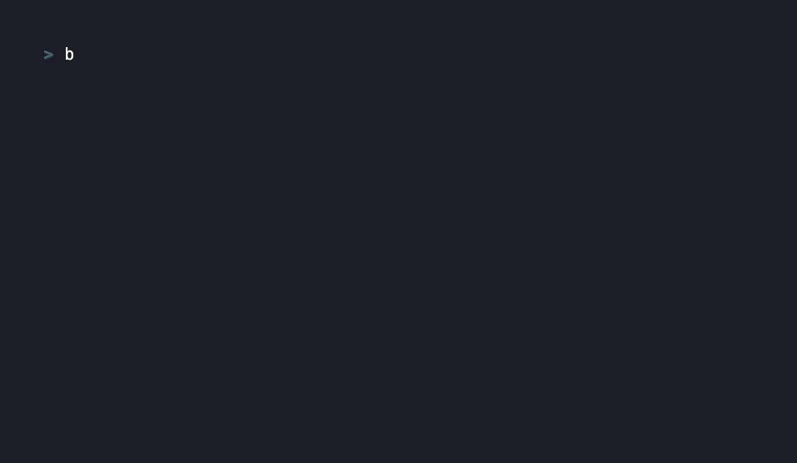

# Actenon

**The open proof gate and receipt standard for consequential AI actions.**

> **No valid proof, no execution.**

Actenon sits at the execution boundary and stops AI agents, MCP tools, browser agents, coding agents, and workflow automations from taking consequential actions — deleting data, moving money, changing access, deploying code, exporting records — unless the endpoint can verify a cryptographic proof bound to the *exact* action being attempted. Every decision leaves a verifiable **Receipt** or **Refusal** artifact for audit, compliance, and trust.

[](docs/assets/actenon-hero-devops.gif)

[](https://github.com/Actenon/actenon/actions/workflows/ci.yml) · [](LICENSE) · [](pyproject.toml) · [Conformance suite](CONFORMANCE.md) · [Adversarial security tests](docs/security/SECURITY_TESTING.md) · [Release gate](scripts/verify_release_gate.sh)

---

## See it in 60 seconds

```bash
git clone https://github.com/Actenon/actenon.git
cd actenon

python3 -m venv .venv && source .venv/bin/activate
python3 -m pip install --upgrade pip
python3 -m pip install -e ".[asymmetric]"

bash scripts/demo_hero.sh
```

This is a safe local simulation. It does not contact any cloud account, use external secrets, or perform a real destructive action.

You will see the side effect path that would be reached without a proof gate, the Actenon refusal, and the local Receipt artifact for a valid proof-bound action:

```text
ACTENON
No valid proof, no execution.

Agent attempts:
  database.delete_table production_customers

WITHOUT proof gate:
  WOULD EXECUTE
  side_effect_executed: true
  consequence: destructive action reaches side effect path

WITH ACTENON:
  REFUSED
  reason_code: ACTION_HASH_MISMATCH
  side_effect_executed: false
  refusal artifact: artifacts/hero_demo_runtime/live/simulations/replit/refusal.json

VALID PROOF:
  EXECUTED ONCE
  side_effect_executed: true
  receipt artifact: artifacts/hero_demo_runtime/live/simulations/replay-refused/execution_receipt.json

SNAPSHOT:
{
  "refusal": {"reason_code": "ACTION_HASH_MISMATCH", "side_effect_executed": false, "artifact_digest": "sha256:..."},
  "receipt": {"outcome": "executed", "side_effect_executed": true, "artifact_digest": "sha256:..."}
}

Done: unproven action refused; valid proof executed once.
```

For the incident-style walkthrough:

```bash
python3 -m actenon.cli simulate --incident replit
```

For the local runtime and trace viewer:

```bash
python3 -m actenon.cli up          # local proof gate + trace viewer on http://127.0.0.1:8421
python3 -m actenon.cli doctor      # health check
```

The full walkthrough is in [QUICKSTART.md](QUICKSTART.md) and [docs/guides/FIRST_10_MINUTES.md](docs/guides/FIRST_10_MINUTES.md).

---

## Choose your path

| If you are… | Start here |
| --- | --- |
| Just curious | Watch the GIF, run `bash scripts/demo_hero.sh` |
| Building agents or MCP tools | [Protect an MCP tool in 3 steps](#protect-an-mcp-tool-in-3-steps) · [MCP_HERO_PATH.md](MCP_HERO_PATH.md) |
| Reviewing security | [Why this isn't just middleware](#why-this-isnt-just-middleware) · [THREAT_MODEL.md](THREAT_MODEL.md) · [Security testing](docs/security/SECURITY_TESTING.md) |
| Designing enterprise architecture | [docs/architecture/TRUST_BOUNDARIES.md](docs/architecture/TRUST_BOUNDARIES.md) · [docs/architecture/DEPLOYMENT_ARCHITECTURES.md](docs/architecture/DEPLOYMENT_ARCHITECTURES.md) |
| Maintaining an open-source agent repo | [The advisory scanner](#the-advisory-scanner) |
| Evaluating governance or standards | [An open standard, not lock-in](#an-open-standard-not-lock-in) · [CONFORMANCE.md](CONFORMANCE.md) · [GOVERNANCE.md](GOVERNANCE.md) |
| Considering contributing | [Contributing](#contributing) |

---

## The execution gap

AI systems no longer just choose words. They call tools, hit provider APIs, change state, and initiate irreversible actions.

Most stacks already have authentication, policy, approval, or workflow state. Those matter — but they don't guarantee that the *execution edge* performs the *exact approved action, exactly once*. An action can be approved upstream and then executed with the wrong parameters, the wrong target, the wrong tenant, or executed twice.

That missing boundary is the **execution gap**, and Actenon closes it with **proof-bound execution**: the protected endpoint independently verifies a proof bound to the exact action, audience, tenant, subject, target, scope, expiry, and replay identity *before* any side effect happens.

Read the full problem statement in [THE_EXECUTION_GAP.md](THE_EXECUTION_GAP.md).

---

## Find your execution gap

Actenon includes a local advisory scanner that maps candidate AI-controlled consequential action paths in your repo.

It does not accuse your repo of being vulnerable. It asks a narrower question:

> If an agent can reach this action path, could it cause a consequential side effect without proof-bound execution?

Run it locally:

    python3 -m actenon.cli scan repo --path .

Example output shape:

    Candidate consequential action path:
      browser.submit / database.delete / file.write / deploy / export

    Consequence class:
      Critical-impact candidate, if reachable and ungated

    Vulnerability claim:
      no

    Runtime reachability:
      not proven

    Suggested control:
      require proof before submit/delete/export/update/deploy

The scanner is a map, not a verdict. It helps maintainers identify where a protected endpoint, approval gate, credential broker, or proof-bound execution boundary may be needed.

Scanner is the discovery layer. The protected endpoint is the control. Receipt and Refusal artifacts are the evidence.

Read more: [Execution Gap Scanner Methodology](docs/guides/EXECUTION_GAP_SCANNER_METHODOLOGY.md)

---

## Why this isn't just middleware

Actenon is not a client-side safety wrapper. The agent and the SDK are **not** the trust boundary — the **protected endpoint** is.

```text
   Untrusted agent
        │  wants to act
        ▼
   SDK / tool client
        │  sends action + proof
        ▼
┌─────────────────────────┐
│   Protected endpoint    │  ← enforcement boundary
└─────────────────────────┘
        │  verifies proof before any side effect
        ▼
   Proof verifier · policy · replay/escrow · credential broker
        │  allowed only if valid, exact-action proof
        ▼
   Consequential action
        ▼
   Receipt or Refusal artifact
```

A consequential action executes only when the endpoint verifies proof bound to the exact action parameters, tenant, subject, audience, expiry, and replay state. If the proof is missing, expired, replayed, audience-mismatched, action-mismatched, parameter-mismatched, tenant-mismatched, or policy-denied, the endpoint refuses *before* the side effect and emits a Refusal.

**This is why prompt injection can make an agent *want* to act, but it should not make a protected action *execute* without valid proof.**

The strongest deployment removes standing production credentials from the agent path entirely:

```text
agent → protected endpoint → brokered single-use credential → production system
(no standing agent credential)
```

If the agent still holds a raw production credential that reaches the provider directly, Actenon can still produce proof, receipts, and refusals for the protected path — but it cannot stop side-door execution on an unprotected one. See [docs/architecture/TRUST_BOUNDARIES.md](docs/architecture/TRUST_BOUNDARIES.md), [docs/architecture/BYPASS_RESISTANCE.md](docs/architecture/BYPASS_RESISTANCE.md), and [docs/guides/CREDENTIAL_BROKER_DEPLOYMENT.md](docs/guides/CREDENTIAL_BROKER_DEPLOYMENT.md).

---

## Protect an MCP tool in 3 steps

**1. Identify the side effect.** This tool executes whenever the MCP server receives the call:

```python
@mcp.tool()
def delete_customer(customer_id: str):
    db.execute("DELETE FROM customers WHERE id = ?", [customer_id])
    return {"status": "deleted"}
```

**2. Require proof at the endpoint.** Verify a proof bound to the exact action before the side effect. The simplified shape looks like this; see the linked examples for runnable code:

```python
@mcp.tool()
def delete_customer(customer_id: str, proof: dict):
    action = {
        "type": "database.delete",
        "resource": "customers",
        "parameters": {"customer_id": customer_id},
    }

    verification = actenon.verify(
        proof=proof,
        action=action,
        audience="mcp://customer-admin/delete_customer",
    )

    if not verification.allowed:
        return actenon.refuse(reason=verification.reason, action=action)

    db.execute("DELETE FROM customers WHERE id = ?", [customer_id])
    return actenon.receipt(status="executed", action=action, proof=proof)
```

**3. Test the refusal path.** A protected tool must refuse when proof is missing, expired, replayed, audience-mismatched, action-mismatched, parameter-mismatched, or issued for a different tenant, subject, or policy boundary.

Start with [`examples/hello_protected_endpoint/`](examples/hello_protected_endpoint) (the smallest example), then [`examples/mcp_server_protected_tool/`](examples/mcp_server_protected_tool) and [INTEGRATIONS.md](INTEGRATIONS.md).

---

## What a receipt and a refusal look like

Every decision produces a portable, structured artifact. A refusal:

```json
{
  "outcome": "refused",
  "reason_code": "ACTION_HASH_MISMATCH",
  "side_effect_executed": false,
  "pccb_id": "pccb_incident_replit",
  "action_hash": "badc0ffe…",
  "artifact_digest": "sha256:9408f4573e097f38…"
}
```

An executed action:

```json
{
  "outcome": "executed",
  "side_effect_executed": true,
  "receipt_id": "rcpt_sim_replay_0002",
  "pccb_id": "pccb_sim_replay_001",
  "artifact_digest": "sha256:353c73da14c3a688…"
}
```

These are real artifacts written by the demo under `artifacts/hero_demo_runtime/`. For copied Cloud-issued proof and outcome verification, see [docs/guides/CLOUD_TO_KERNEL_VERIFICATION.md](docs/guides/CLOUD_TO_KERNEL_VERIFICATION.md).

---

## Where Actenon changes the outcome

Actenon is built for the execution gap exposed by real AI-agent failure patterns — the moment an agent moves from *suggesting* an action to *causing* one.

| Failure pattern | What Actenon enforces |
| --- | --- |
| [Production database deletion](docs/incidents/REPLIT_STYLE_DATABASE_DELETE.md) | No exact signed proof → refused before execution; Refusal emitted |
| [Destructive production action](docs/incidents/PRODUCTION_DESTRUCTIVE_ACTION.md) | Proof must bind the exact action, subject, tenant, audience, and expiry |
| [Data export / exfiltration](docs/incidents/DATA_EXPORT_EXFILTRATION_PATTERN.md) | Export requires scoped proof, policy approval, audience binding, and a receipt |
| [IAM privilege escalation](docs/incidents/IAM_PRIVILEGE_ESCALATION_PATTERN.md) | Access mutation requires proof-bound approval and credential brokering |
| [MCP / tool proof laundering](docs/incidents/MCP_TOOL_PROOF_LAUNDERING.md) | Tool execution requires proof at the protected endpoint |

The claim is narrow and testable: **if a consequential action is routed through an Actenon-protected endpoint, it cannot execute without valid proof bound to that exact action.**

---

## What Actenon does, and does not do

Actenon **does**:

- refuse unproven consequential actions at a protected endpoint, before the side effect
- bind proof to exact action parameters, plus tenant, subject, audience, expiry, scope, and replay identity
- consume replay / escrow where configured, and broker single-use credentials after verification
- emit portable Receipt and Refusal artifacts
- run fully locally — verification, conformance tests, and copied Cloud-issued artifact verification need no hosted service

Actenon **does not**:

- stop a model from *trying* to act, or make a bad-but-authorized action good
- protect actions that are *not* routed through a protected endpoint (a standing agent credential is a side door)
- prevent replay unless the protected endpoint actually enforces the replay path
- prove downstream business finality, or that a provider behaved honestly after handoff
- replace IAM, OAuth, service mesh, API gateways, or human-approval workflows — it composes with them
- certify that a repo is vulnerable
- claim insurer endorsement, regulator recognition, hosted transparency, or production KMS/HSM custody in the open-source kernel

A compromised issuer or signer can still mint valid proof for the wrong action; mint-audit records improve *detectability*, not *prevention*. The complete asset/attacker/limit analysis is in [THREAT_MODEL.md](THREAT_MODEL.md), and the exact guarantees are in [KERNEL_GUARANTEES.md](KERNEL_GUARANTEES.md).

---

## The advisory scanner

`actenon scan` maps candidate AI-controlled consequential action paths in a repo. It is **advisory** — it does not accuse maintainers of shipping vulnerabilities.

```bash
python3 -m actenon.cli scan repo --path .
python3 -m actenon.cli scan mcp --path examples/mcp_server_protected_tool
```

Findings use **consequence-class** language, not vulnerability-severity language:

> *Critical-impact candidate action path, if reachable and ungated.* Not a vulnerability claim. Runtime reachability and exploitability not proven. Suggested control: add an approval or proof gate before the side effect (Actenon's `ProtectedExecutor` is one implementation).

A *Critical-impact candidate* means an action surface could have critical consequences if reachable, agent-controlled, and ungated — not that a critical vulnerability has been proven. See [docs/guides/EXECUTION_GAP_SCANNER_METHODOLOGY.md](docs/guides/EXECUTION_GAP_SCANNER_METHODOLOGY.md).

---

## An open standard, not lock-in

Actenon provides verifiable evidence that a specific consequential action was approved, refused, executed, or blocked under a defined proof and policy boundary. The doctrine is simple:

> The standard stays open. Operational services are built around it.

You do **not** need Actenon Cloud — or anyone's permission — to issue, verify, or test compatible receipts, or to implement the neutral Verifiable Action Receipt surface. The kernel, specs, conformance suite, SDKs, and examples here are **Apache-2.0**, which adds an explicit contributor patent grant so implementers, competitors, platforms, and standards bodies can adopt it as neutral infrastructure.

A hosted control plane may add enterprise policy management, approvals, dashboards, credential brokering, audit storage, and tenant administration — but receipt verification and conformance testing remain open. The exact public/commercial line is in [OPEN_SOURCE_BOUNDARY.md](OPEN_SOURCE_BOUNDARY.md).

Read: [GOVERNANCE.md](GOVERNANCE.md) · [CONFORMANCE.md](CONFORMANCE.md) · [SPEC_INDEX.md](SPEC_INDEX.md) · [VERSIONING_POLICY.md](VERSIONING_POLICY.md)

---

## Documentation

| Topic | Document |
| --- | --- |
| Run the local proof-gate demo | [QUICKSTART.md](QUICKSTART.md) |
| First 10 minutes, end to end | [docs/guides/FIRST_10_MINUTES.md](docs/guides/FIRST_10_MINUTES.md) |
| The problem, in depth | [THE_EXECUTION_GAP.md](THE_EXECUTION_GAP.md) |
| The category | [CATEGORY.md](CATEGORY.md) |
| Threat model, attackers, limits | [THREAT_MODEL.md](THREAT_MODEL.md) |
| Exact kernel guarantees | [KERNEL_GUARANTEES.md](KERNEL_GUARANTEES.md) |
| Architecture & trust boundaries | [docs/architecture/TECHNICAL_ARCHITECTURE.md](docs/architecture/TECHNICAL_ARCHITECTURE.md) |
| Credential broker deployment | [docs/guides/CREDENTIAL_BROKER_DEPLOYMENT.md](docs/guides/CREDENTIAL_BROKER_DEPLOYMENT.md) |
| Wrap consequential MCP tools | [MCP_HERO_PATH.md](MCP_HERO_PATH.md) |
| Scanner methodology & wording | [docs/guides/EXECUTION_GAP_SCANNER_METHODOLOGY.md](docs/guides/EXECUTION_GAP_SCANNER_METHODOLOGY.md) |
| SDKs (Python, TypeScript, Go, Rust) | [SDK_SELECTION_GUIDE.md](SDK_SELECTION_GUIDE.md) · [SUPPORT_AND_COMPATIBILITY_STATUS.md](SUPPORT_AND_COMPATIBILITY_STATUS.md) |
| Specs index | [SPEC_INDEX.md](SPEC_INDEX.md) |
| Open-source vs commercial boundary | [OPEN_SOURCE_BOUNDARY.md](OPEN_SOURCE_BOUNDARY.md) |
| Compliance mapping | [COMPLIANCE_MAPPING.md](COMPLIANCE_MAPPING.md) |

---

## Who it's for

Platform and security teams protecting consequential tools, routes, or provider calls; SDK and framework teams integrating protected tools into agent stacks; enterprise architects composing agent controls with IAM, OAuth, gateways, and approval systems; open-source maintainers who want neutral advisory scanning instead of vulnerability theatre; and anyone who needs portable receipts and refusals rather than internal logs.

---

## Contributing

Actenon is a good fit for contributors interested in AI agents, security tooling, MCP, open standards, and developer experience. Strong first contributions:

- **Scanner rules** — detection for shell execution, file writes/deletes, browser submits, email sends, data exports, payments, deployments, IAM changes, database mutations, and MCP tool side effects.
- **Framework examples** — minimal proof-gated examples for MCP servers, LangChain, CrewAI, LlamaIndex, browser-use, and tool-calling agents.
- **SDK conformance** — conformance tests for language SDKs and receipt verification.
- **Docs** — quickstart clarity, architecture diagrams, threat-model examples, receipt/refusal examples.

Start with [CONTRIBUTING.md](CONTRIBUTING.md), [SECURITY.md](SECURITY.md), and [CODE_OF_CONDUCT.md](CODE_OF_CONDUCT.md). Useful labels: `good first issue`, `scanner`, `docs`, `sdk`, `mcp`, `conformance`, `examples`, `security`.

---

## Releasing

Before any public release or launch archive:

```bash
bash scripts/verify_release_gate.sh
```

That gate blocks on the focused keystone suite, the full `pytest` run, Ruff, public-boundary validation, and clean public-archive creation.

---

## License

[Apache-2.0](LICENSE). The open kernel, specs, conformance suite, SDKs, and examples are permissively licensed with an explicit contributor patent grant — chosen so the Verifiable Action Receipt surface can become neutral, widely-adopted infrastructure.
