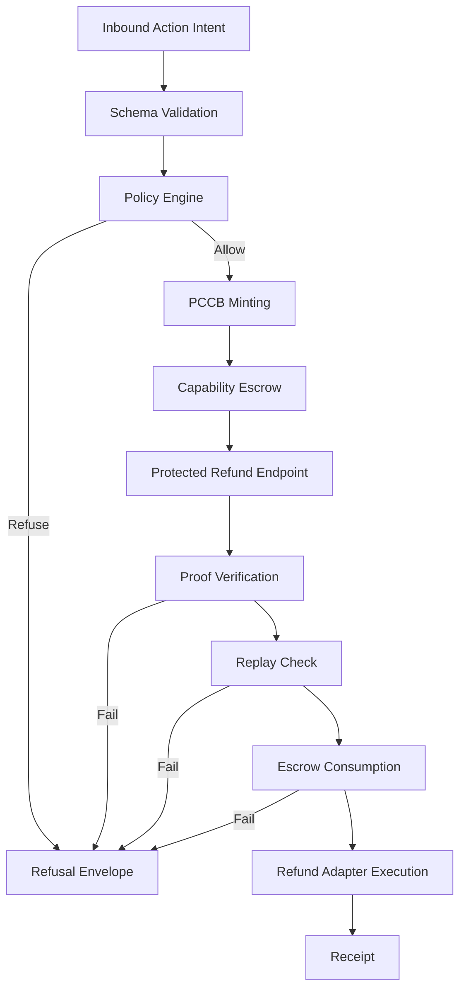

# Protected Execution Kernel Architecture

## Architecture Goal

Build a generic kernel that can accept a consequential Action Intent, evaluate policy, mint proof, bind capability usage, and allow a protected endpoint to execute exactly once or refuse safely.

Core principle: No proof, no action.

## Component Responsibilities

The target repository layout maps cleanly to runtime responsibilities:

- `/actenon/api`: external APIs for Action Intent submission, proof-aware execution, and status lookup
- `/actenon/core`: orchestration of the protected execution flow
- `/actenon/policy`: hard rules, tenant rules, dynamic context evaluation, and policy snapshots
- `/actenon/proof`: PCCB creation, signing, parsing, and verification helpers
- `/actenon/escrow`: Capability Escrow lifecycle and single-use consumption
- `/actenon/verifier`: endpoint-side proof, policy binding, and request verification
- `/actenon/receipts`: receipt and refusal envelope generation plus persistence helpers
- `/actenon/replay`: replay key generation, replay ledger, and duplicate detection
- `/actenon/adapters`: dynamic context providers and protected action adapters
- `/actenon/storage`: storage interfaces and local implementations
- `/actenon/models`: internal request, decision, proof, escrow, receipt, and refusal models

## Core Runtime Objects

### Action Intent

The Action Intent is the canonical request to perform a consequential action. It is the only admissible starting point for protected execution.

### PCCB

The PCCB is the proof artifact issued after a successful policy decision. It is the material the protected endpoint verifies before executing the action.

### Capability Escrow Record

The escrow record binds the approved proof to a single executable capability with explicit state transitions such as issued, released, consumed, expired, or revoked.

### Refusal Envelope

The refusal envelope is the canonical structured output for any denied or invalid execution path.

### Receipt

The receipt is the canonical structured output for a successful protected action.

## Control Flow

## Step-By-Step Execution Model

1. A client submits an Action Intent for refund execution.
2. The API layer validates the intent against the schema.
3. The policy layer evaluates hard rules, tenant rules, and dynamic context.
4. If policy denies, the system returns a refusal envelope and stops.
5. If policy allows, the proof layer mints a PCCB bound to the approved action details.
6. The escrow layer creates a single-use capability record associated with that proof.
7. The protected refund endpoint receives the request plus proof material.
8. The verifier checks PCCB integrity, expiry, action binding, and tenant binding.
9. The replay layer checks whether the proof or capability has already been used.
10. The escrow layer consumes the capability atomically.
11. The refund adapter performs the protected refund action.
12. The receipts layer emits a receipt for success or a refusal envelope for failure.

## Policy Model

Policy evaluation must combine three sources:

- hard rules: non-bypassable global safety and compliance constraints
- tenant rules: tenant-specific permissions, thresholds, and business policy
- dynamic context: current payment state, refundable balance, actor status, and any runtime risk facts

The output of policy evaluation should be stable for the same input snapshot and auditable after the fact.

## Proof Model

The proof model must bind the allowed action tightly enough that the protected endpoint can reject substitution attempts.

At minimum the proof should bind:

- intent identity or digest
- tenant identity
- actor identity
- action type
- target resource
- amount
- currency
- issue time
- expiry time
- proof identifier or nonce

Local proof mode should use deterministic local signer material or equivalent local verification machinery so the system can be tested and demonstrated without external dependencies.

## Capability Escrow Model

Capability Escrow exists so a valid proof does not automatically imply unlimited execution rights.

Escrow responsibilities:

- create a record for the approved capability
- track state transitions
- enforce single-use consumption
- reject revoked, expired, or already-consumed capability usage
- provide enough evidence for replay defense and audit

## Replay Protection Model

Replay protection should not rely on proof verification alone.

The kernel should maintain replay-relevant identifiers such as proof identifiers, consumed capability identifiers, or intent execution keys so the same approved action cannot be executed twice.

## Protected Endpoint Model

The protected refund endpoint must treat proof verification as a prerequisite, not a logging aid.

The endpoint must refuse execution when:

- no proof is presented
- the proof is invalid or expired
- the proof does not match the requested refund parameters
- the escrow capability is invalid
- the action has already been executed

## Storage Model

The implementation should keep storage behind interfaces so local and production backends can diverge without changing the kernel contract.

Recommended baseline:

- local mode: SQLite or equivalent embedded durable store
- future production mode: relational store with atomic updates and queryable audit history

## Observability Model

Every stage should produce structured logs and durable records keyed by identifiers such as:

- `intent_id`
- proof identifier
- escrow capability identifier
- `receipt_id`
- refusal code

This is required for acceptance, not optional polish.

## Refund Wedge Boundaries

The first wedge is refund execution only.

Included:

- policy-gated refund approval
- proof-required refund execution
- refusal and receipt emission
- local proof mode support

Excluded from the first wedge:

- invoice payment execution
- batch operations
- payout flows
- disputes
- settlement orchestration
